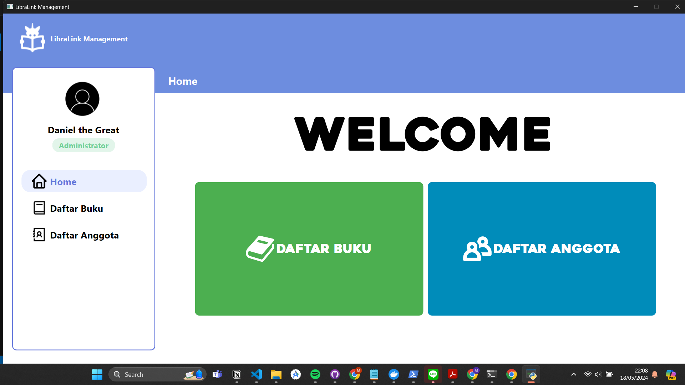

# Libralink: Library Management

## Overview


Libralink is a desktop software application that is built for the purpose of managing a library. Libralink provides the ease for user to manage and maintain the activity in library primarily the borrowing of books by the assigned members of the library. Libralink allows user to add, edit, and delete books or members of the library, provides information necessary about them such as the status of a book or a member, books being borrowed by a member, and even the time period of a borrowed book.

With Libralink, users enjoy the convenience of not needing to verify or validate impossible scenarios, making it exceptionally user-friendly.
## Prerequisites

- `Python` 3.X installed
- `Pytest` installed for unit testing. To install, run the following command:

```bash
pip install pytest
```

- `PySide6` installed. To install, run the following command:

```bash
pip install PySide6
```

- `python-dateutil` installed. To install, run the following command:

```bash
pip install python-dateutil
```

- Run the following command to make sure you have editable or development mode applied:

```bash
pip install -e .
```


- Cloned repository files. To clone, run one the following command:

```
git clone https://gitlab.informatika.org/NgokNgok04/if-2250-2024-k01-g08-libralink.git
```

## Setup
### Database
If the database `libralink.db` is not found in `/src/database/`, run the following command from the root of repository.

```bash
python src/database/db_init.py
```
### PyTest (Optional)

To test if the database is correctly initialized, run unit tests with following command from the root of repository.
```bash
pytest test
```
It is recommended to have a newly initialized database for this test, as modifications might cause false negatives.

## How to Run the Application
### Starting the App
1. After setup, navigate to the root of this repository which is `if-2250-2024-k01-g08-libralink`.
2. To start the application, run the following:

```bash
python src/ui/Main.py
```

## Modules
### Project Structure
Below is the directory structure of this application's source code. Each file directory in `src/` is implemented as Python packages.
```
├───assets
│   ├───book cover
│   ├───fonts
│   ├───icons
│   └───images
├───coverage
├───src
│   ├───controller
│   ├───database
│   ├───libralink.egg-info
│   ├───models
│   └───ui
│       ├───components
├───test
```

### Database Structure
#### 1. anggota
| Field             | Type             | Null      |  Key      | Default   | Extra          |
| ----------------  | ---------------- |  -------- |  -------- |  -------- |  --------      | 
| anggota_id        | int              | NO        | PRI       | NULL      | auto_increment |
| nama              | varchar          | NO        |           | NULL      |                |
| email             | varchar          | NO        |           | NULL      |                |
| status_anggota    | bool             | NO        |           | NULL      |                |

#### 2. buku
| Field             | Type             | Null      |  Key      | Default   | Extra          |
| ----------------  | ---------------- |  -------- |  -------- |  -------- |  --------      | 
| buku_id           | int              | NO        | PRI       | NULL      | auto_increment |
| judul             | varchar          | NO        |           | NULL      |                |
| isbn              | varchar          | NO        |           | NULL      |                |
| path              | varchar          | NO        |           | NULL      |                |


#### 3. peminjaman
| Field                 | Type             | Null      |  Key      | Default   | Extra          |
| ----------------      | ---------------- |  -------- |  -------- |  -------- |  --------      | 
| buku_id               | int              | NO        | PRI, MUL  | NULL      |                |
| annggota_id           | varchar          | NO        | PRI, MUL  | NULL      |                |
| tanggal_pinjam        | varchar          | NO        |           | NULL      |                |
| tanggal_pengembalian  | varchar          | NO        |           | NULL      |                |

## Authors & Contributions
### Authors
| NIM      | Name                        | GitHub                                            |
| -------- | ----------------------------| ------------------------------------------------- |
| 13522009 | Muhammad Yusuf Rafi         | [cupskii](https://github.com/cupskii)             |
| 13522029 | Ignatius Jhon Hezkiel Chan  | [chankiel](https://github.com/chankiel)           |
| 13522043 | Daniel Mulia Putra Manurung | [Gryphuss](https://github.com/Gryphuss)           |
| 13522093 | Matthew Vladimir hutabarat  | [NgokNgok04](https://github.com/NgokNgok04)       |
| 10023371 | Aisyah Dinah Zain           | [madinah12](https://github.com/madinah12)         |
### Contributions
| NIM      | Contributions                                                                                    |
| -------- | ------------------------------------------------------------------------------------------------ |
| 13522009 | form_buku, unittest                                                                              |
| 13522029 | daftar_peminjaman, form_peminjaman functionality, database, unittest                             |
| 13522043 | daftar_buku, form anggota, form buku functionality, database, unittest, CI-CD                    |
| 13522093 | form anggota, form buku , form peminjaman structure, sidebar, header, database, unittest, CI-CD  |
| 10023371 | ALL design Figma, unittest                                                                       |